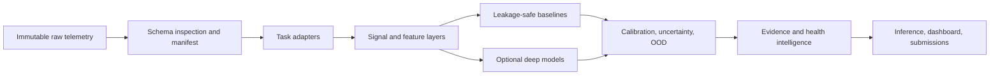

# Architecture

```mermaid
flowchart LR
  R[Immutable raw telemetry] --> I[Schema inspection and manifest]
  I --> A[Task adapters]
  A --> F[Signal and feature layers]
  F --> B[Leakage-safe baselines]
  F --> D[Optional deep models]
  B --> U[Calibration, uncertainty, OOD]
  D --> U
  U --> E[Evidence and health intelligence]
  E --> P[Inference, dashboard, submissions]
```

All four tracks share infrastructure at stable boundaries while retaining independent parsing,
model selection, validation, and official output rules.

